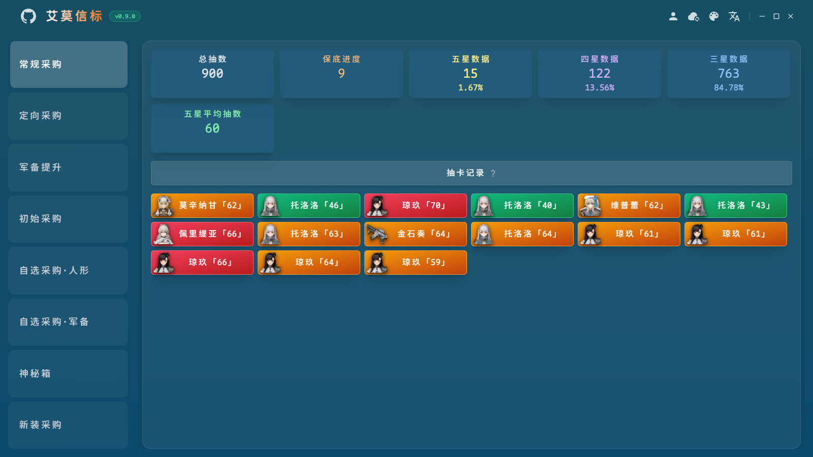

     

Languages: <a href="./README.md">简体中文</a> | English

## Preview

## Introduction

<a href="https://github.com/YizeNE/ElmoBeacon" rel="nofollow">ElmoBeacon</a> is a tool for storing and analyzing gacha records from <i>Girls' Frontline 2: Exilium</i>. It supports the Dark Winter (China, North America) and the Haoplay (Global, Asia, Japan, Korea).

This is an open-source project maintained by <a href="https://gf2.mcc.wiki" rel="nofollow">MccWiki</a> and the community. If you have any ideas, feel free to submit a PR!

## Requirements

- GF2 client
- Fiddler
- Go 1.18+ (dev only)
- Wails v2 CLI (dev only)
- Node.js 18+ (dev only)

## Usage Guide

1. Since local game logs no longer store access tokens, you need to use a packet capture tool. Download [Fiddler](https://api.getfiddler.com/fc/latest) (by default Fiddler captures only HTTP, so you need to configure it to capture HTTPS as well – see [this reference](https://developer.aliyun.com/article/1342462)).
2. After configuring Fiddler, ensure it is running, then view your gacha history in the game. Fiddler will show a record with a Host like `gf2-gacha-record-xxx` and a URL like `/list?xxx`. Right-click this record, select **Save > Selected Sessions > as Text**, and save it locally.
3. Open this software, click "Sync Records", enter **your own UID**, and select the record file saved in step 2 to start retrieving your gacha history. (**⚠ The local record has a validity period; please repeat step 2 periodically to refresh it.**)

## Local Development

1. Clone this repository locally.
2. Run `wails dev` in the project root directory.