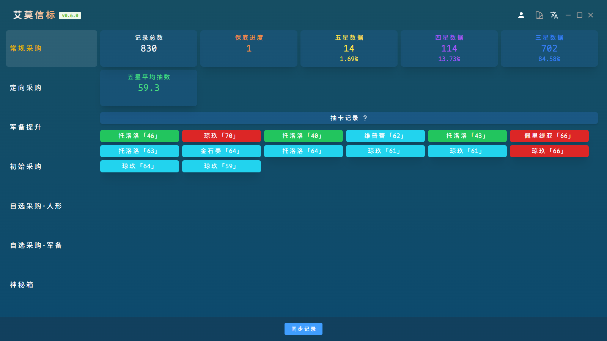

  
  
  
  

## 图片预览

## 项目介绍

<a href="https://github.com/YizeNE/ElmoBeacon" rel="nofollow">ElmoBeacon</a> is a tool for storing and analyzing GFL2 gacha records.

The project is compatible with DarkWinter server(China,North America) and Haoplay server(Global,Asia,Japan,Korea).

This is an open source project and maintained by <a href="https://gf2.mcc.wiki" rel="nofollow">MccWiki</a> and the community.

The program has implemented the basic features. UI will be optimized later.

If you have any ideas for UI, feel free to PR!

## 项目需求

- <a href="https://developer.microsoft.com/en-us/microsoft-edge/webview2" rel="nofollow">WebView2</a> (embedded)
- GFL2 Client
- Go 1.18+ (develop only)
- <a href="https://wails.io/docs/gettingstarted/installation/" rel="nofollow">Wails</a> (develop only)

## 使用教程

1. 由于游戏日志不再存储用户凭证，因此需要使用抓包软件来获取[点此下载Fiddler](https://api.getfiddler.com/fc/latest)（默认情况下Fiddler只能抓取HTTP请求，因此还需要进行配置[参考](https://developer.aliyun.com/article/1342462)）
1. 配置好Fiddler后确保Fiddler正在运行，然后在游戏内点击访问记录，此时Fiddler记录中会出现一条Host为`gf2-gacha-record-xxx`，URL为`/list?xxx`的记录，右键此条记录Save>Selected Sessions>as Text将该条记录保存至本地
1. 打开本软件，点击同步记录后输入自己的UID并选择步骤2中保存至本地的记录即可开始获取抽卡记录（⚠本地记录具有时效性，请定期按步骤2重新获取）

## 本地开发

1. clone the project to local
2. run `wails dev` to dev,`wails build` to build
